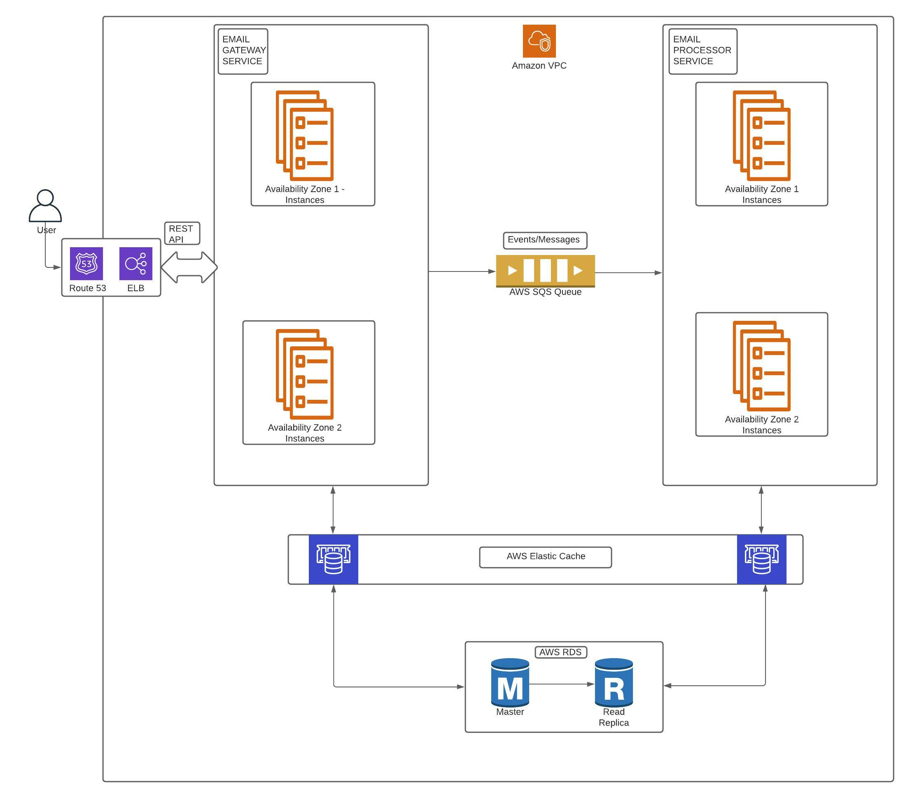

### Architectiure Overview  

### Architectiure Choices

1. **Microservices and Event based architecture**: Have split the solution in to two different services, keeping in mind the single responsibility principle. 
   
   a) **Email Gateway**: This service is responsible for user facing REST api's related to emails submitted. As soon as the email is submitted via POST an email *id* is sent to user with HTTP status code 202 i.e. email has been accepted for processing.

   This way we avoid req/resp latency and timout issues which a user would have faced. The service exposes additional GET endpoints for user to check for email processing status. 

   b) **Email Processor**: This service listens to email related events on the AWS SQS queue.  
   When it receives the messages it tries to sends the message via a primary mail provider (ElasticEmail), and fallbacks to a secondary email provider (Sendgrid) in case of failures.  

2. **Scalability**: The solution is highly scalable as both the gateway and processor services are stateless, which mean we can horizontally scale both the services independently.    
AWS RDS can be scaled by adding read replicas which will allow us to distribute read queries to multiple database instances.
Adding AWS elastic cache layer further improves the system performance.

1. **Availability/Reliability**: The solution is highly available, both microservice are deployed across multiple data centers/availability zones, and AWS ELB will manage the failover if needed.  
AWS RDS promotes a replica as master in event of a failure.  
   

2. **Data loss/Durability/Resiliency**: The system ensures that valid data is persisted. As part of `POST /submitEmail`  the data is validated and then persisted in the database. The processing for sending of email happens after this step, this ensures that any email processing related errors does not cause any data loss.    
The solution is resilient as every interaction with the external email provider has a timeout of 3 seconds, this is to avoid performance degradation in case of downtime of external email services.  
The database is setup with replicas to avoid any data loss due to master failure.   
To further prevent any data corruption issues transactions can be used where necessary.  
For emails which goes to FAILED status a periodic job can be scheduled to trigger there processing.  

1. **Maintainability**: Both the services *email-gateway* and *email-processor* can be deployed and scaled independently.  
   To clean up old records from the database a Lambda may be scheduled say to remove 6 months old records.  
   A back up of these deleted records can be maintained on S3 if needed for compliance purposes.

2. **Auditing**: A complete audit trail of each email processing is being maintained in the ``EmailHistores`` table.   
   This is an append only table which means for any change in the processing status of the email a new record for that emailId is added to this table with status as PROCESSING/SENT/FAILED.  
   Along with the status this table also keep tracks of the email provider (Sendgrid/ElasticEmail) responsible for that status.  
   As part of `POST \submitEmail` the request JSON payload is also stored in the database for auditing and support purposes to see the original request which was sent by the user.

6. **Error Handling**: For bad POST input request an aggregated response with all the errors is sent back to the user, this leads to better user experience.  
   Appropriate error codes like 404: Not Found for invalid email id when doing GET are used in error responses

7. **Constraints/Tradeoffs**:  
   a) This solution is not suitable for cross region users, as we are not using a multi regions database, so users outside the database region can face latency with REST api's. However it may not be worth investing in a multi region database right at the start, as we should observe the usage pattern.   
   b) Both the services share a common database schema which leads to some level of coupling between the two. In case of two isolated teams managing the services, there are chances of a breaking change being made to the DB. But if we have a single team working on the project a single db schema can lead to simplicity and ease of development.    
   c) In case of failures from both email service providers there can be high delay in delivery of emails. For emails which goes to FAILED status a periodic job can be scheduled to trigger there processing. 
   d) The REST api's are not secured. We can look to add JWT based security.  
   e) The logs can be sent to a log indexing solution like Datadog for monitoring and quick discovery fo errors.
   f) An open tracing solution like Jaeger can be used, to trace the flow of HTTP request through the microservices.
   g) The microservices can be integrated with error tracking tools like Sentry to report errors.

     
